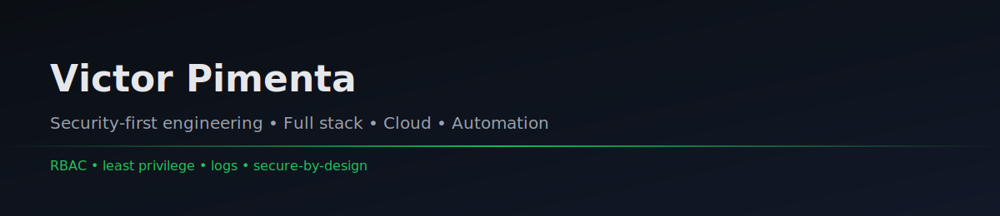

Construo aplicações com foco em segurança, arquitetura e automação.
Segurança para mim é decisão de design: controle de acesso, rastreabilidade, limites e padrões simples.

## Sobre mim

Sou estudante de Ciência da Computação e desenvolvedor em formação, com forte interesse em segurança da informação aplicada ao desenvolvimento de sistemas.

Gosto de entender como as coisas funcionam por dentro: permissões, fluxos, limites e falhas. Tento levar essa mentalidade para o código, buscando soluções simples, legíveis e seguras.

Este GitHub reúne projetos acadêmicos e pessoais onde exploro desenvolvimento full stack, automação, cloud e integração de IA.

Quando posso estou jogando ou praticando algum esporte

---

## Destaques
- Segurança aplicada em APIs e aplicações web (RBAC, least privilege, logs)
- Desenvolvimento full stack (React, Python, PostgreSQL, Docker)
- Cloud e automação (AWS, CI/CD básico)
- IA aplicada quando faz sentido (integração e protótipos)

## Projetos
- AgroBot: visão computacional e automação para seleção de morangos
- Wimar Acessórios: e-commerce full stack com foco em estrutura e controle de acesso
- Nutri Pet: app mobile em Flutter com integração de dados

## Stack

## Contato

  
  
  
  

